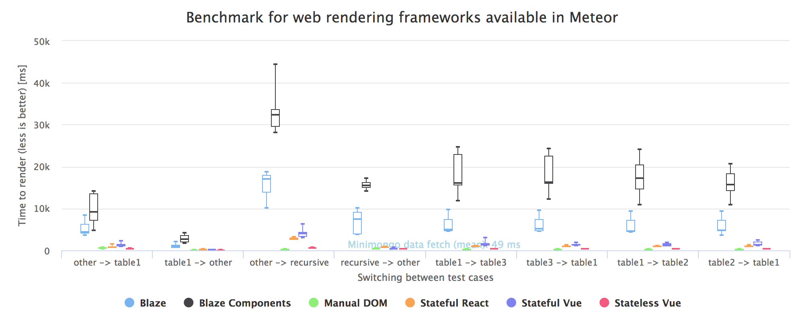
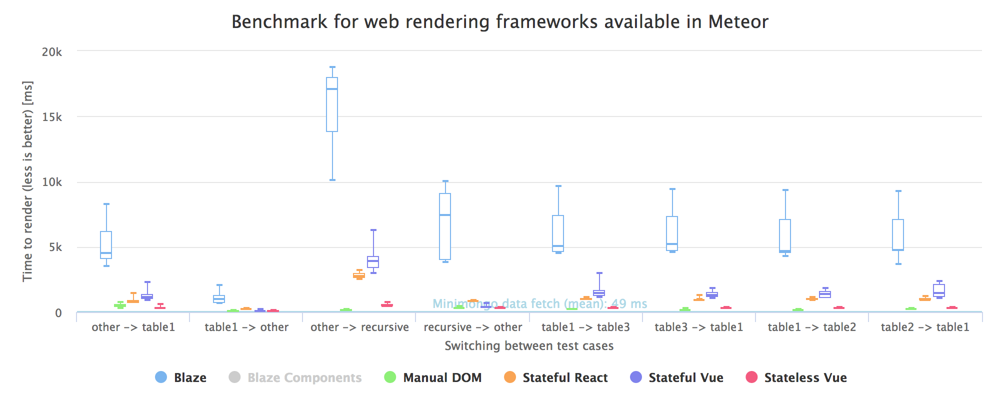
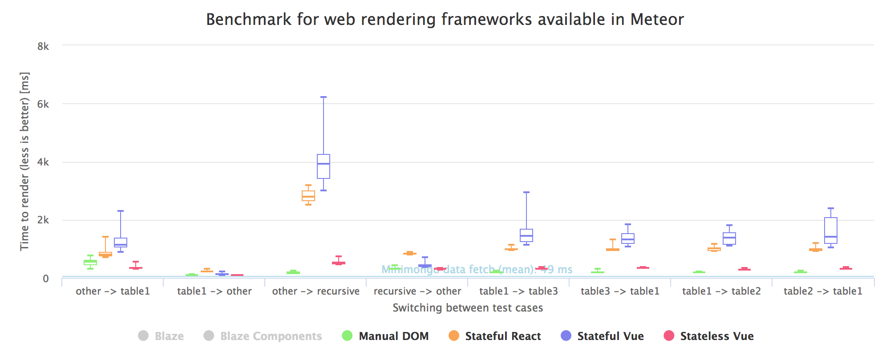
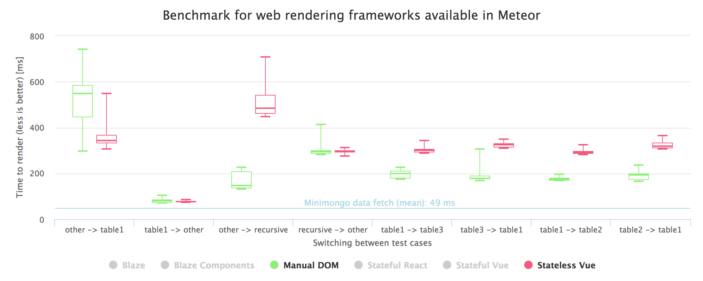
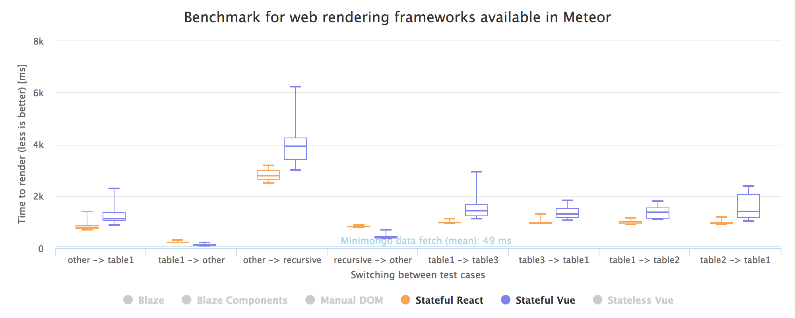

Benchmark for web rendering frameworks available in Meteor
==========================================================

This benchmark tries to compare various reactive rendering frameworks available in Meteor.
It focuses on rendering large chunks of content and measuring how long it takes for them to
appear in DOM. The rationale is that the user cares the most about delays in such rendering
because it is often the result of their actions, like clicking on a link and waiting for a new
page to render. On the other hand, updates to existing content coming from changes to data
have many other delays already (like changes being detected and propagated to the client) and
user also in most cases does not know when the change really occurred, to be able to perceive
a delay. Of course, performance of such updates is important as well and benchmark will include
them in the future ([#4](https://github.com/mitar/meteor-web-rendering-framework-benchmark/issues/4)).

Results
-------











Results of running it on Google Chrome v59.

<!-- Made with browser window set to 1000px width. -->

Test cases
----------

* *Other*: A simple paragraph of text.
* *Table 1* and *Table 2*: A large table of data with many columns and rows. Contains also buttons to test attaching
(and cleaning) of event handlers. The idea is that, when switching between them, ideally the rendering framework would
detect that the structure of both tables is the same, and just update content, instead of rebuilding the whole structure
from scratch. Of course the developer could also just update the data source to help the rendering engine, but in many
cases user is switching between pages which have the same structure, and apps do not just change the data source, but
render a new page with same internal components.
* *Table 1 & 2*: A table where half of the content comes from *Table 1* and half from *Table 2*. One would hope that
switching between *Table 1 & 2* and *Table 1* or *Table 2* would take half of the time of switching between
*Table 1* and *Table 2*.
* *Recursive*: A large recursive structure with event handlers at the end. Both expensive to build and expensive to
clean.

Running
-------

To run benchmark, [install Meteor](https://www.meteor.com/install), clone the repository, and run:

```
$ meteor
```

Open [http://localhost:3000](http://localhost:3000) and you will see multiple buttons to run various test cases
and benchmarks. During the benchmark, you can follow progress in the console (to not interfere with DOM to
display progress), and at the end a chart like the one above will be shown.

Benchmark seems pretty sensitive to load on the computer where is being run so it is best to not do anything
else and keep the browser tab focuses and visible during the whole run (which can take an hour or so for all
frameworks).

Contributing
------------

Feel free to provide your frameworks and their implementations of test cases. Both optimized and non-optimized.
The benchmark is trying to measure both how one would implement this as a novice, but also how an
expert would optimize.